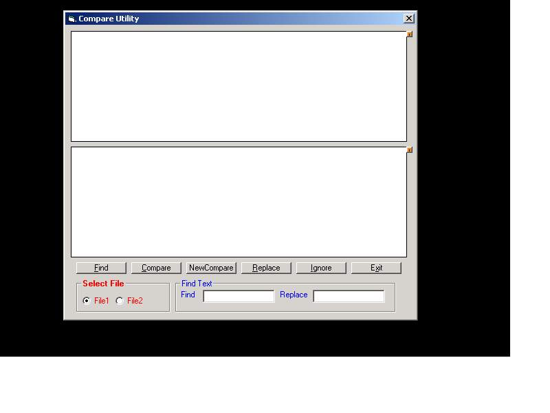



## Compare Man

### Description

Find replace are the additional features added to compare functionality between two files.It finds the any word specified if present and does corresponding replace.The it also compares two files .Can be called as compare tool
 
### More Info
 

             |
---                |---
**Submitted On**   |2002-02-19 16:55:58
**By**             |[Sameer Kulkarni](https://github.com/Planet-Source-Code/PSCIndex/blob/master/ByAuthor/sameer-kulkarni.md)
**Level**          |Advanced
**User Rating**    |4.0 (28 globes from 7 users)
**Compatibility**  |VB 4\.0 \(32\-bit\), VB 5\.0, VB 6\.0, VB Script
**Category**       |[Complete Applications](https://github.com/Planet-Source-Code/PSCIndex/blob/master/ByCategory/complete-applications__1-27.md)
**World**          |[Visual Basic](https://github.com/Planet-Source-Code/PSCIndex/blob/master/ByWorld/visual-basic.md)
**Archive File**   |[Compare\_Ma561162192002\.zip](https://github.com/Planet-Source-Code/sameer-kulkarni-compare-man__1-31921/archive/master.zip)

